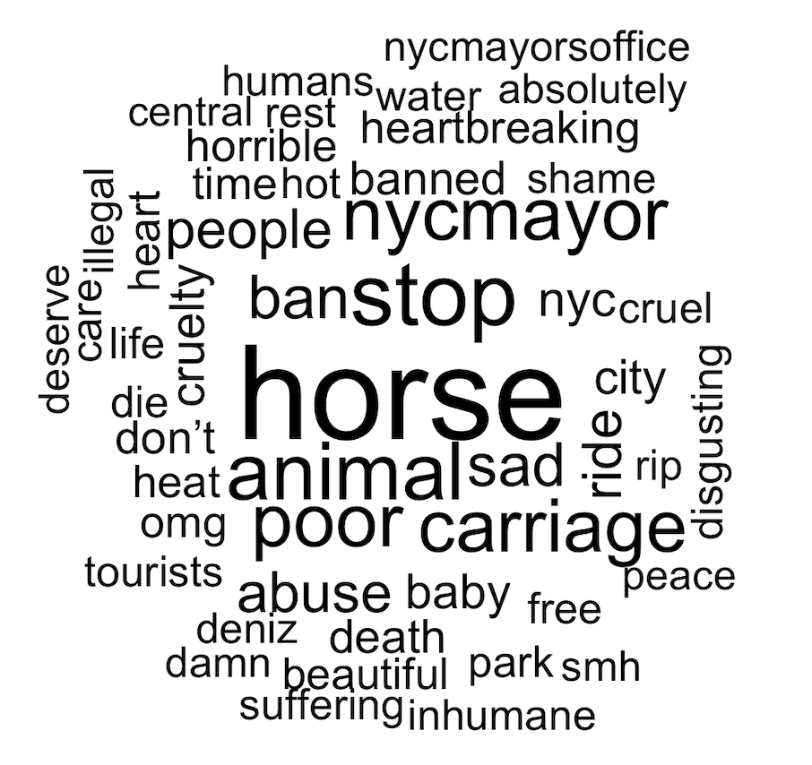
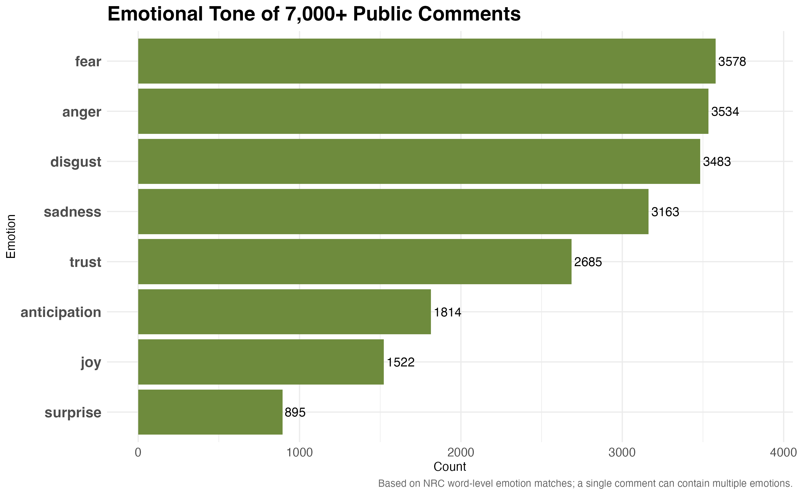
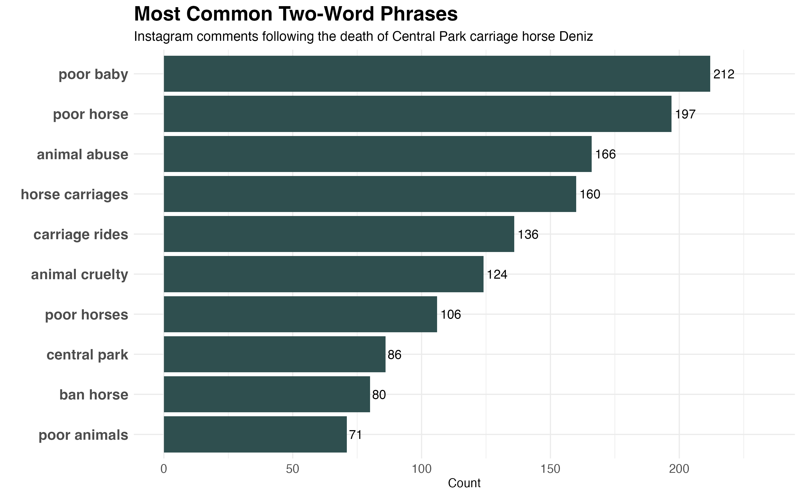

# Animal Welfare NLP Project

## Overview

This independent project uses natural language processing (NLP) in R to analyze over 7,000 publicly available Instagram comments following the death of Central Park carriage horse Deniz.

After learning about the incident, I became interested in how people were responding online. Using text mining and sentiment analysis, I explored common themes, emotional patterns, and policy-related discussions surrounding the event.

The project demonstrates practical applications of R for analyzing and communicating insights from real-world public data.


## Methods

The analysis was completed in R using the tidyverse and tidytext ecosystem.

The workflow included:

- Importing and cleaning publicly available Instagram comments
- Removing duplicate comments and stop words
- Tokenizing text into individual words and bigrams
- Word frequency analysis
- Word cloud visualization
- NRC emotion analysis
- Bigram analysis
- Data visualization using ggplot2


## Key Findings

- Words such as **horse**, **stop**, **animal**, **ban**, and **carriage** appeared most frequently, reflecting the dominant topics of discussion.
- **Fear**, **anger**, and **disgust** were the three most common emotions identified using the NRC Emotion Lexicon.
- References to New York City's mayor and city leadership appeared more than 1,000 times, suggesting that many commenters viewed the incident as a policy issue rather than an isolated event.
- One of the more unexpected findings was the frequent use of the word **"baby,"** highlighting the protective and familial language many commenters used when referring to the horse.


## Repository Structure

```
animal-welfare-nlp/
├── data/        # Documentation only (raw data not included)
├── output/      # Figures generated from the analysis
└── scripts/     # R analysis code
```


## Visualizations

### Word Cloud



### NRC Emotion Analysis



### Most Common Bigrams




## Data Availability

The original Instagram comments are not included in this repository because they may be subject to platform terms of service. The analysis script is provided for transparency and can be adapted to a similarly structured dataset.


## Software

- R
- tidyverse
- tidytext
- ggplot2
- wordcloud
- readxl
- textdata
